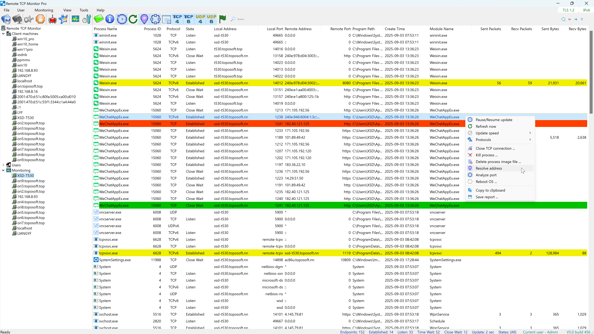

# Remote TCP Monitor

**Remote TCP Monitor** is a centralized network tool for viewing real-time TCP and UDP connection details across local and remote hosts. Designed for enterprise-level service monitoring, it offers powerful remote access capabilities and centralized management to ensure network availability and operational clarity.

---

## 🔍 Key Features

- 🔧 **Centralized Maintenance**  
  Unified management interface for all monitored hosts.

- 🧭 **Host-Level Navigation**  
  Quickly locate listening services and port usage across systems.

- 🌐 **IPv4 & IPv6 Dual-Stack Support**  
  Full compatibility with modern network environments.

- 📌 **Real-Time Service Feedback**  
  Instant visibility into service status for diagnostics and troubleshooting.

- 🔍 **Detailed Endpoint View**  
  Displays TCP/UDP listening ports, connection states, local/remote addresses, associated process and module names, network traffic, etc.

---

## 🚀 Automated Deployment via ONE Series Framework

Remote TCP Monitor leverages the **ONE Series Remote Installation Framework** to streamline agent deployment:

- 🛠️ Agent distribution and installation without manual intervention  
- 🔄 Automated update and maintenance mechanisms  
- 🧩 Seamless integration with other ONE tools for unified network operations

---

## 🌍 Broad Monitoring Support

Remote TCP Monitor offers comprehensive monitoring capabilities across a wide range of devices and operating systems:

- **Cross-Platform Host Coverage**: Full support for Windows (x64/ARM64), macOS (Apple Silicon ARM64 / Intel x86_64), and multi-architecture Linux systems.
- **Embedded & Network Appliances**: Extended support for embedded environments, including NAS devices, enterprise APs, OpenWrt routers, and industrial gateways (ARM32/ARM64/MIPS/MIPSEL).
- **Flexible Network Reach**: Monitor local servers, workstation clusters, or remote hosts across the Internet (subject to network and firewall configurations).

Whether managing a small server pool or a large, heterogeneous distributed infrastructure, Remote TCP Monitor delivers a scalable and maintainable solution for network connectivity visibility.

---

## 🖥️ Supported Operating Systems & Architectures

This section outlines officially validated platform specifications for both the **Controller (GUI Management Console)** and the **Monitored Target Devices (TCPv Agent Services)**.

### 1. Controller (Management Console)

The management console runs on 64-bit Microsoft Windows platforms. On Windows ARM64 devices (such as Snapdragon X processors), it runs seamlessly via Microsoft's built-in compatibility layer.

| Operating System / Target Platform | Minimum Supported Version | Execution Mode | Status |
| :--- | :--- | :--- | :---: |
| **Windows x64** | Windows 10 (1809+ / Build 17763) / Server 2016 | Native x64 Execution | Supported |
| **Windows 11 x64** | Windows 11 (All builds) | Native x64 Execution | Supported |
| **Windows ARM64** | Windows 11 Build 22000+ (Snapdragon X / Surface ARM) | Executed within **built-in Windows ARM64 x64 compatibility layer (Prism)** | Supported |

### 2. Monitored Target Devices (TCPv Agent Services)

Client machines are target hosts and appliances monitored remotely via the `tcpvsvcd` daemon. Select the target architecture via the **Select OS Arch** menu during host configuration to deploy the correct binary.

| Operating System / Target Platform | Target Architecture / Platform | Minimum Supported Version | Architecture Details & Common Hardware | Status |
| :--- | :--- | :--- | :--- | :---: |
| **Windows** | **x64 (64-bit)** | Windows 10 / Server 2016 | Standard PC / Workstation / Server (Intel/AMD 64-bit) | Supported |
| | **ARM64** | Windows 11 Build 22000+ | Modern ARM 64-bit (Windows on ARM / Snapdragon X) | Supported |
| **macOS** | **ARM64** | macOS 11.0 (Big Sur) | Modern ARM 64-bit (Apple Silicon - M1/M2/M3/M4) | Supported |
| | **x86_64** | macOS 11.0 (Big Sur) | Legacy Intel Mac (Intel Core/Xeon 64-bit) | Supported |
| **Linux** *(Includes embedded devices like NAS, Routers, Gateways)* | **x86_64** | Kernel 2.6.39+ | Standard PC, Cloud Server, x86 NAS (Synology, QNAP, Unraid) | Supported |
| | **ARM64 / AArch64** | Kernel 3.10+ | Modern ARM Servers, Single-Board Computers, ARM NAS, Raspberry Pi 4/5 | Supported |
| | **ARMv7 Hard-Float** | Kernel 2.6.39+ | ARMv7 32-bit (EABIHF / armhf) - Industrial Gateways, Smart Switches | Supported |
| | **ARMv7 SoftFP** | Kernel 2.6.36+ | ARMv7 32-bit + VFPv3 (EABI) - High-Performance Routers, Home Gateways | Supported |
| | **ARMv7 Pure Soft-Float** | Kernel 2.6.36+ | ARMv7 32-bit (EABI) - Legacy Embedded Systems (No FPU) | Supported |
| | **MIPS32 Big-Endian** | Kernel 2.6.36+ | MIPS32 BE - Pure Soft-Float (`mips`) - Routers, Enterprise APs, Embedded Devices | Supported |
| | **MIPSEL32 Little-Endian** | Kernel 2.6.22+ | MIPSEL32 LE - Pure Soft-Float (`mipsel`) - OpenWrt Routers, Compact NAS, TV Boxes | Supported |

> *Note: The listed hardware examples are not exhaustive; other compatible devices may also apply.*

---

## 🛒 UWP app from Microsoft Store

| Edition | Description | Store Link |
|--------|-------------|------------|
| **Trial** | Full monitoring features with a 30-day trial period | [Get Trial](https://apps.microsoft.com/detail/9N9VFVV2KVJG?hl=en-us&gl=CN&ocid=pdpshare) |
| **Std** | Full monitoring features for small networks | [Get Std](https://apps.microsoft.com/detail/9N0M98DCR26T?hl=en-us&gl=CN&ocid=pdpshare) |
| **Pro** | Full monitoring features for medium to large networks | [Get Pro](https://apps.microsoft.com/detail/9P4GP7TWN8ML?hl=en-us&gl=CN&ocid=pdpshare) |

---

## 📦 Installation

To install Remote TCP Monitor agents remotely, it is recommended to use the built-in ONE Series Remote Installation Framework.  
Refer to the [Installation Guide](docs/installation.md) for step-by-step instructions.

---

## 📄 License

This repository is for documentation and binary distribution only.  
Forking is not permitted for derivative work or redistribution.  
Remote TCP Monitor is a **commercial product** and not open source.

---

## 📬 Support

For product inquiries, licensing, or technical support, please contact the publisher via the Microsoft Store or your enterprise support channel.
